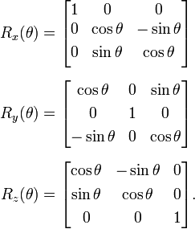

## Rotation Transformation in 3D Space

Rotation transformation involves rotating points about an axis passing through the origin. This transformation is fundamental in graphics applications, particularly when working with the coordinate axes X, Y, and Z.

### Rotation Matrices

Rotation is performed by multiplying the point with a rotation matrix. Specific matrices exist for rotations about X, Y, and Z axes, each playing a standard role in graphic transformations.

**Rotation Matrix (for rotation about the Z-axis):**

  

Rotations can also be executed about an arbitrary axis, following these steps:

1. Rotate the arbitrary axis about one of the coordinate axes (e.g., Y) to align it with one of the coordinate planes (e.g., XY).
2. Rotate this axis about the Z-axis to align it with the Y-axis.
3. Perform the required rotation about the Y-axis using the rotation matrix RY.
4. Reverse the steps 2 and 1 to restore the axis to its original alignment.

### Rotation about a Specific Point

Rotation matrices inherently rotate all points about an axis passing through the origin. To rotate about a specific point, a translation operation is necessary. The matrix for rotating about a particular point is given by:

M = T-1RT

Here, T translates the point to the origin, R is the rotation matrix, and T translates the point back to its original location.

### Frame of Reference

Understanding the frame of reference is crucial when considering rotations, as all rotations are described relative to a particular frame of reference. For any orthogonal transformation on a body in a coordinate system, there is an inverse transformation that, when applied to the frame of reference, results in the body being at the same coordinates. For example, in two dimensions, rotating a body clockwise about a point while keeping the axes fixed is equivalent to rotating the axes counterclockwise about the same point while keeping the body fixed. Thus, a rotation of 45° about the Z-axis is equivalent to rotating the coordinate system by -45° about the Z-axis.